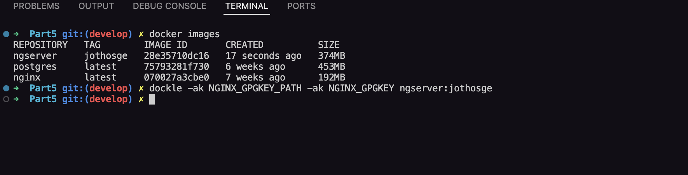
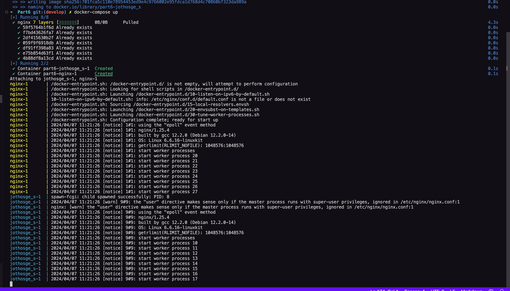

# Docker first steps

# Contents

- [Docker first steps](#docker-first-steps)
- [Contents](#contents)
- [Part 1. Готовый докер](#part-1-готовый-докер)
- [Part 2. Операции с контейнером](#part-2-операции-с-контейнером)
- [Part 3. Мини веб-сервер](#part-3-мини-веб-сервер)
- [Part 4. Свой докер](#part-4-свой-докер)
- [Part 5. Dockle](#part-5-dockle)
- [Part 6. Базовый Docker Compose](#part-6-базовый-docker-compose)

# Part 1. Готовый докер

**Возьми официальный докер-образ с nginx и выкачай его при помощи docker pull.**

**Проверь наличие докер-образа через docker images.**

**Запусти докер-образ через docker run -d [image_id|repository].**

**Проверь, что образ запустился через docker ps.**

**Посмотри информацию о контейнере через docker inspect [container_id|container_name].**

**Останови докер образ через docker stop [container_id|container_name].**

**Проверь, что образ остановился через docker ps.**

**Запусти докер с портами 80 и 443 в контейнере, замапленными на такие же порты на локальной машине, через команду run.**

**Проверь, что в браузере по адресу localhost:80 доступна стартовая страница nginx.**

**Перезапусти докер контейнер через docker restart [container_id|container_name].**

**Проверь любым способом, что контейнер запустился.**

# Part 2. Операции с контейнером

Докер-образ и контейнер готовы. Теперь можно покопаться в конфигурации nginx и отобразить статус страницы.

Прочитай конфигурационный файл nginx.conf внутри докер контейнера через команду exec.

Скопируй созданный файл nginx.conf внутрь докер-образа через команду docker cp.

nginx.conf

Перезапусти nginx внутри докер-образа через команду exec.

Проверь, что по адресу localhost:80/status отдается страничка со статусом сервера nginx.

Экспортируй контейнер в файл container.tar через команду export.

Останови контейнер.

Удали образ через docker rmi [image_id|repository], не удаляя перед этим контейнеры. Удали остановленный контейнер.

Импортируй контейнер обратно через команду import. 

Запусти импортированный контейнер.

Проверь, что по адресу localhost:80/status отдается страничка со статусом сервера nginx.

# Part 3. Мини веб-сервер

Мини-сервер на C & FastCgi:

nginx.conf:

Смотрим что получилось:

# Part 4. Свой докер

Докер-образ:

Сбор образа и запуск:

Смотрим images:

Теперь посмотрим можем ли мы подключиться к серверу:

Изменим nginx.conf страничку /status

# Part 5. Dockle

Просконировал образ и вот что получилось:

Вот какие изменения я ввёл в dockerfile а так-же необходимо ввести `export DOCKER_CONTENT_TRUST=1` в конслоль

Немного объяснений:

`HEALTHCHECK --interval=3m --timeout=3s CMD [ "curl", "-f", "http://localhost/", "||", "exit", "1" ] - используется в Dockerfile для определения проверки состояния контейнера. Эта команда выполняет проверку состояния контейнера, отправляя HTTP-запрос на localhost с помощью утилиты curl. Если запрос возвращает код состояния 200, то контейнер считается здоровым. В противном случае, если запрос не возвращает код состояния 200, команда exit 1 вызывает выход с ненулевым кодом, что указывает на нездоровое состояние контейнера.

Теперь проверим что выведит команда `dockle -ak NGINX_GPGKEY_PATH -ak NGINX_GPGKEY ngserver:jothosge'

-ak в dockle используются для добавления ключа подверждения такие как GPG

# Part 6. Базовый Docker Compose

yaml file: 

Проверяем есть ли запущенные контейнеры и билдим compose:

Поднимаем compose:

Смотрим работает ли переадресация:

Посмотрим что выдаст нам командная строка в которой запущены контейнеры:

[UP](#docker-first-steps)